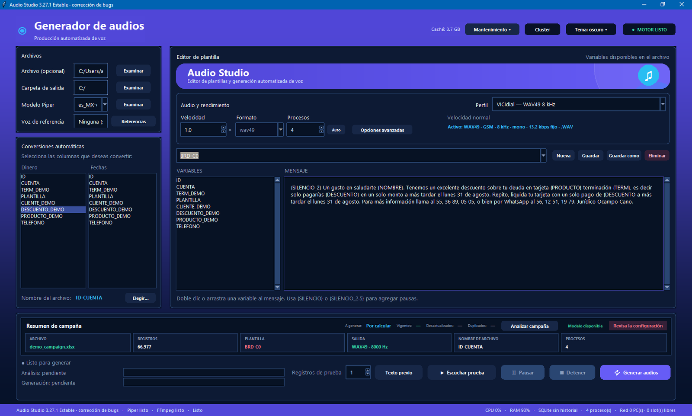

# AI Voice Batch Engine

> Offline AI voice generation, batch processing and telephony-oriented audio conversion with Python, Piper, OpenVoice and FFmpeg.



## Overview

AI Voice Batch Engine is a sanitized portfolio edition of a larger desktop application developed for high-volume personalized audio generation.

The production application was designed for Spanish-speaking operational environments and combines local neural Text-to-Speech, template-driven message generation, concurrent processing, audio conversion, caching, performance monitoring and optional voice conversion.

**Repository documentation is written in English for international accessibility. The desktop application shown above is in Spanish.**

> **Portfolio edition:** Proprietary business logic, customer data, production configuration, voice models, authentication mechanisms and internal integrations are intentionally excluded.

## What the System Does

The application can take structured input data and dynamically generate personalized speech messages from reusable templates.

A simplified processing flow is:

```text
Structured Data / Text
        |
        v
Text Normalization
        |
        v
Template + Dynamic Variables
        |
        v
Piper TTS (Local Inference)
        |
        v
PCM / Audio Cache
        |
        v
Optional Voice Conversion
        |
        v
Audio Processing + FFmpeg
        |
        +---- WAV
        +---- GSM / WAV49
        +---- MP3
```

The complete production application also includes campaign orchestration, resource management, detailed performance metrics and optional processing across authorized computers on a local network.

## Tech Stack

- **Python** — application and processing engine
- **Piper TTS** — offline neural speech synthesis
- **OpenVoice** — optional voice conversion
- **FFmpeg** — audio conversion and telephony-oriented formats
- **NumPy / Pandas** — data and audio-related processing
- **Multiprocessing / Threading** — concurrent workloads
- **SQLite** — local persistence and processing history
- **Desktop UI** — production application interface

## Engineering Highlights

### Offline Neural TTS

Speech synthesis is performed locally with Piper voice models. This reduces dependency on external cloud TTS services and provides greater control over batch processing.

### Dynamic Message Generation

The production application supports reusable message templates with dynamic variables. Structured records can therefore be transformed into personalized audio without manually creating each message.

### Batch Processing

The system is designed around campaign-style workloads rather than single-message synthesis. Jobs can be distributed among multiple worker processes according to available hardware resources.

### Multi-level Caching

Repeated synthesis and voice-processing work can be reduced by reusing previously generated artifacts. The production application contains more advanced cache management than the simplified public implementation.

### Optional Voice Conversion

A separate OpenVoice processing environment can be used after TTS generation. Keeping voice conversion isolated from the main application helps separate dependencies and processing responsibilities.

### Audio Conversion

FFmpeg is used as part of the output pipeline. The production application supports standard audio as well as telephony-oriented profiles, including 8 kHz output workflows.

### Performance Monitoring

The full application tracks operational metrics such as:

- TTS processing time
- voice-conversion time
- queue wait time
- cache behavior
- worker utilization
- generated-audio throughput
- total campaign duration

### Local Distributed Processing

The production architecture includes the ability to use authorized computers on the same LAN as additional processing capacity.

Only the architectural concept is documented publicly. Networking, authentication, node discovery and production job-distribution code are intentionally excluded.

## Public Demo Code

The code in `src/voice_engine/` is intentionally small. Its purpose is to demonstrate the public-facing structure of the TTS pipeline without publishing the complete production application.

```python
from voice_engine import VoiceEngine

engine = VoiceEngine("models/es_MX-demo.onnx")
engine.load()

engine.synthesize(
    "Hola, esta es una demostración del motor de voz.",
    "output/demo.wav",
)
```

Voice models are not included in this repository.

## Repository Structure

```text
ai-voice-batch-engine/
├── src/
│   └── voice_engine/
│       ├── __init__.py
│       ├── engine.py
│       ├── normalizer.py
│       └── audio.py
├── examples/
│   └── basic_usage.py
├── docs/
│   └── architecture.md
├── screenshots/
│   └── main-interface.png
├── requirements.txt
├── .gitignore
├── LICENSE
└── README.md
```

## Production Application vs. Portfolio Edition

| Capability | Production application | Public repository |
| --- | :---: | :---: |
| Offline Piper TTS | Yes | Simplified |
| Text normalization | Yes | Simplified |
| FFmpeg audio pipeline | Yes | Example |
| Batch campaign processing | Yes | Architecture only |
| Multiprocessing | Yes | Architecture only |
| Multi-level caching | Yes | Architecture only |
| OpenVoice integration | Yes | Architecture only |
| Performance metrics | Yes | Documentation only |
| Desktop interface | Yes | Screenshot only |
| LAN distributed processing | Yes | Architecture only |
| Internal integrations | Yes | No |
| Customer/business logic | Yes | No |

## Why This Project

The project focuses on the engineering challenges involved in generating large quantities of personalized speech locally while maintaining predictable processing behavior and avoiding dependence on cloud-based TTS services.

Key areas of work include:

- local AI inference
- concurrency and CPU utilization
- reusable audio fragments and caching
- batch workload orchestration
- audio processing
- failure handling
- performance measurement
- modularization of AI voice components

## Current Development

The original system grew into a larger desktop application containing UI, batch orchestration and voice-processing components.

A standalone TTS engine is currently being developed to separate the voice-generation layer from the desktop application and make the architecture more modular.

A separate Speech-to-Text project is also planned for call-center / collection-workflow audio transcription.

## Privacy and Intellectual Property

This repository is intended to demonstrate engineering experience without exposing proprietary implementation details.

It does **not** contain production customer data, credentials, private databases, production voice models, complete business rules, internal templates, authentication secrets or the full source code of the original application.

---

**Python · TTS · Speech AI · Piper · OpenVoice · FFmpeg · Multiprocessing · Audio Processing**
